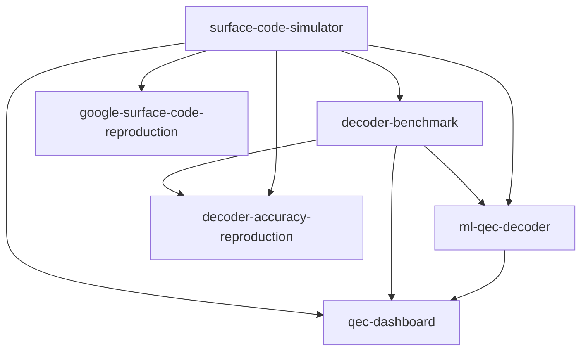

# Quantum Error Correction Portfolio

A seven-part portfolio of quantum-error-correction software, built to demonstrate research-engineering
ability across simulation, decoding algorithms, machine learning, observability, resource modelling,
and reproduction of landmark results. Every repository is independently installable, tested, and
CI-ready, and the later repositories build on the earlier ones.

Common stack: [Stim](https://github.com/quantumlib/Stim) (stabilizer simulation),
[PyMatching](https://pymatching.readthedocs.io/) (MWPM), Pydantic v2 typed configs, pytest, and
GitHub Actions CI. Each repo follows the same `src/` layout, RORO interfaces, and MIT license.

## The repositories

| # | Repository | What it does | Highlight |
|---|-----------|--------------|-----------|
| 1 | [`surface-code-simulator`](surface-code-simulator/) | Circuit-level surface-code Monte Carlo: build, sample, decode, threshold. | Clean threshold crossing at p_th ~ 0.6%. |
| 2 | [`decoder-benchmark`](decoder-benchmark/) | Benchmark MWPM vs from-scratch union-find and belief propagation on accuracy/runtime/memory. | BP shown to be dominated, reproducing the literature. |
| 3 | [`qec-dashboard`](qec-dashboard/) | Streamlit operational dashboard over simulation/benchmark artifacts. | Decoupled data contracts + bundled sample data. |
| 4 | [`ml-qec-decoder`](ml-qec-decoder/) | Random forest, XGBoost and a PyTorch MLP decoder, with an honest ML-vs-MWPM regime analysis. | Calibrated finding: ML approaches but does not beat MWPM. |
| 5 | [`fault-tolerance-economics`](fault-tolerance-economics/) | Resource/cost model; how many qubits to break RSA-2048 with Shor. | Reproduces ~20M qubits / ~8 hours (Gidney-Ekera). |
| 6 | [`google-surface-code-reproduction`](google-surface-code-reproduction/) | Simulation reproduction of Google's Nature 2023 scaling result. | Reproduces error suppression Lambda ~ 2.2 below threshold. |
| 7 | [`decoder-accuracy-reproduction`](decoder-accuracy-reproduction/) | Exact MWPM-vs-optimal decoder comparison (arXiv:2311.12503). | Exact enumeration: MWPM optimal at d=3, sub-optimal at d=5. |

## Suggested reading order

For a reviewer with limited time: **6 -> 7 -> 2 -> 1 -> 4 -> 5 -> 3**. Repos 6 and 7 show the
ability to reproduce published research; 2 and 1 show the core simulation and decoding engineering;
4 and 5 show applied ML and quantitative modelling; 3 shows productisation.

## Dependency graph



## Quick start

Each repository is standalone:

```bash
cd surface-code-simulator
pip install -e ".[dev]"
pytest
```

For the repos that depend on siblings (2, 3, 4, 7), install the upstream repos editable into the
same environment first; see each repo's README for the exact commands.

## Test status

All repositories pass their test suites locally (Python 3.10-3.14):

- surface-code-simulator: 15 passed
- decoder-benchmark: 15 passed
- ml-qec-decoder: 7 passed
- qec-dashboard: 4 passed
- fault-tolerance-economics: 7 passed
- google-surface-code-reproduction: 4 passed
- decoder-accuracy-reproduction: 4 passed

## Write-ups

Long-form, paper-structured write-ups of each project (plus this overview) live in
[`writeups/`](writeups/), as both Markdown (for reading on GitHub) and downloadable Word documents,
each with embedded result figures:

| # | Write-up | Markdown | Word |
|---|----------|----------|------|
| - | Portfolio overview | [md](writeups/md/00_portfolio_overview.md) | [docx](writeups/docx/00_portfolio_overview.docx) |
| 1 | Surface-code simulator | [md](writeups/md/01_surface_code_simulator.md) | [docx](writeups/docx/01_surface_code_simulator.docx) |
| 2 | Decoder benchmark | [md](writeups/md/02_decoder_benchmark.md) | [docx](writeups/docx/02_decoder_benchmark.docx) |
| 3 | QEC dashboard | [md](writeups/md/03_qec_dashboard.md) | [docx](writeups/docx/03_qec_dashboard.docx) |
| 4 | ML QEC decoder | [md](writeups/md/04_ml_qec_decoder.md) | [docx](writeups/docx/04_ml_qec_decoder.docx) |
| 5 | Fault-tolerance economics | [md](writeups/md/05_fault_tolerance_economics.md) | [docx](writeups/docx/05_fault_tolerance_economics.docx) |
| 6 | Google reproduction | [md](writeups/md/06_google_reproduction.md) | [docx](writeups/docx/06_google_reproduction.docx) |
| 7 | Decoder accuracy reproduction | [md](writeups/md/07_decoder_accuracy_reproduction.md) | [docx](writeups/docx/07_decoder_accuracy_reproduction.docx) |

All write-ups are regenerated from [`writeups/generate_writeups.py`](writeups/generate_writeups.py).

## License

All repositories are released under the MIT License.
