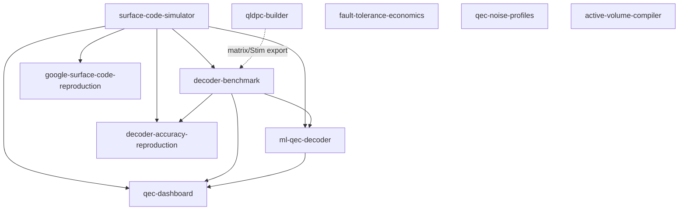

# Research Portfolio

Index of research projects organized by research area. Each project is a standalone,
installable repository with tests, reproducible outputs, and a paper-style write-up.

<!-- BEGIN:summary -->
Current focus: **Quantum Error Correction** -- 10 projects.
<!-- END:summary -->

> The project tables, dependency graph, test status and write-up index below are generated from
> [`portfolio.toml`](portfolio.toml) by [`scripts/build_portfolio_index.py`](scripts/build_portfolio_index.py).
> To add a project, append one entry to the manifest and re-run the script.

## Quantum Error Correction

**This is:** reproducible research software. It reproduces published results from scratch, implements
decoders (union-find, belief propagation, and an exact maximum-likelihood decoder) by hand to study
their behavior, and turns physics into decision-ready resource estimates. The engineering is
production-grade: typed configs, tests against the real Stim/PyMatching stack, and CI across four
Python versions.

**This is not:** a new QEC theory result, a replacement for Stim or PyMatching, or a production
decoder stack. The foundational simulator (`surface-code-simulator`) is an *experiment pipeline*
built on Stim and PyMatching, not a re-implementation of them. The algorithmic
contribution is the **exact maximum-likelihood decoder** (`decoder-accuracy-reproduction`), which
measures how far minimum-weight perfect matching sits from optimal without any Monte Carlo sampling
error, and the **from-scratch peeling decoder** (`qec-noise-profiles`), which reproduces the analytic
0.5 erasure threshold. Engineering trade-offs (including why this is many repos rather than a
monorepo) are documented in [`docs/ARCHITECTURE.md`](docs/ARCHITECTURE.md).

Common stack: [Stim](https://github.com/quantumlib/Stim) (stabilizer simulation),
[PyMatching](https://pymatching.readthedocs.io/) (MWPM), Pydantic v2 typed configs, pytest, and
GitHub Actions CI. Each repo follows the same `src/` layout, RORO interfaces, and MIT license.

## The projects

Start with the capstones; they show the ability to reproduce published research and to implement a
provably-optimal decoder. The foundation and tooling repos underneath are the infrastructure they
build on.

<!-- BEGIN:repositories -->
### Capstones (start here)

| Repository | What it does | Highlight |
|-----------|--------------|-----------|
| [`google-surface-code-reproduction`](https://github.com/afogelis/google-surface-code-reproduction) | Simulation reproduction of Google's Nature 2023 scaling result. | Reproduces error suppression Lambda ~ 2.2 below threshold. |
| [`decoder-accuracy-reproduction`](https://github.com/afogelis/decoder-accuracy-reproduction) | Exact maximum-likelihood vs MWPM decoder comparison by error-pattern enumeration (arXiv:2311.12503). | Sampling-free: MWPM provably optimal at d=3, quantifiably sub-optimal at d=5. |

### Foundation and tooling

| Repository | What it does | Highlight |
|-----------|--------------|-----------|
| [`surface-code-simulator`](https://github.com/afogelis/surface-code-simulator) | Infrastructure layer: circuit-level surface-code Monte Carlo pipeline on Stim + PyMatching (build, sample, decode, threshold). | Clean threshold crossing at p_th ~ 0.6%. |
| [`decoder-benchmark`](https://github.com/afogelis/decoder-benchmark) | Benchmark MWPM vs from-scratch union-find and belief propagation, with separate accuracy and runtime tiers and an optional BP-OSD reference. | Plain BP dominated on accuracy; BP-OSD competitive. |
| [`qec-dashboard`](https://github.com/afogelis/qec-dashboard) | Streamlit artifact viewer over simulation/benchmark outputs (demo/observability). | Decoupled JSON data contracts + bundled sample data. |
| [`ml-qec-decoder`](https://github.com/afogelis/ml-qec-decoder) | A controlled negative study: when do tabular/geometry-aware ML decoders fail against MWPM? | Calibrated finding: ML competitive at d=3, fails at d=5. |
| [`fault-tolerance-economics`](https://github.com/afogelis/fault-tolerance-economics) | Resource/cost model: how many qubits to break RSA-2048 with Shor. | Reproduces ~20M qubits / ~8 hours (Gidney-Ekera). |

### Frontier extensions

Independent, advanced topics that round out the area beyond the basics.

| Repository | What it does | Highlight |
|-----------|--------------|-----------|
| [`qldpc-builder`](https://github.com/afogelis/qldpc-builder) | Build bivariate/generalized-bicycle qLDPC codes; decode with a from-scratch BP+OSD; benchmark encoding rate vs the surface code. | High-rate codes match the surface baseline's logical error rate at several times the rate. |
| [`qec-noise-profiles`](https://github.com/afogelis/qec-noise-profiles) | Biased Pauli noise (weighted matching) and heralded erasure (from-scratch peeling) on the toric code. | Reproduces the analytic 0.5 erasure threshold vs ~0.16 depolarizing. |
| [`active-volume-compiler`](https://github.com/afogelis/active-volume-compiler) | Compile a Clifford+T circuit to a surface-code layout and optimize the magic-state factory ratio. | Volume-optimal factory count at the factory/logic runtime crossover. |
<!-- END:repositories -->

## Suggested reading order

For a reviewer with limited time, read in this order: `decoder-accuracy-reproduction` ->
`google-surface-code-reproduction` -> `qec-noise-profiles` -> `qldpc-builder` -> `decoder-benchmark`
-> `surface-code-simulator` -> `active-volume-compiler` -> `fault-tolerance-economics` ->
`ml-qec-decoder` -> `qec-dashboard`. The first two reproduce published research and implement an
optimal decoder; the next two implement from-scratch qLDPC/erasure decoders with
analytically-checkable thresholds; `decoder-benchmark` and `surface-code-simulator` show the core
decoding and simulation engineering; `active-volume-compiler` and `fault-tolerance-economics` show
fault-tolerant compilation and quantitative modeling; and `ml-qec-decoder` and `qec-dashboard` show
a negative-result ML study and productization.

## Dependency graph

<!-- BEGIN:dependency-graph -->

<!-- END:dependency-graph -->

Solid arrows are `pip` dependencies (pinned to git tags); the dotted edge is a runtime **artifact**
handoff (`qldpc-builder` exports parity-check matrices and a Stim circuit that `decoder-benchmark`
can benchmark), not a package dependency. `qldpc-builder`, `qec-noise-profiles` and
`active-volume-compiler` are otherwise deliberately standalone: each is self-contained (its own code
construction, decoders and resource model) so it can be read and run without the surface-code
foundation.

## Quick start

Each repository is standalone:

```bash
cd surface-code-simulator
pip install -e ".[dev]"
pytest
```

For the repos that depend on siblings (`decoder-benchmark`, `qec-dashboard`, `ml-qec-decoder`,
`decoder-accuracy-reproduction`), install the upstream repos editable into the same environment
first; see each repo's README for the exact commands.

## Test status

All repositories pass their test suites locally (Python 3.10-3.14):

<!-- BEGIN:test-status -->
- surface-code-simulator: 15 passed
- decoder-benchmark: 16 passed, 1 skipped (BP-OSD, optional `ldpc` dependency)
- qec-dashboard: 4 passed
- ml-qec-decoder: 7 passed
- fault-tolerance-economics: 7 passed
- google-surface-code-reproduction: 4 passed
- decoder-accuracy-reproduction: 4 passed
- qldpc-builder: 21 passed
- qec-noise-profiles: 18 passed
- active-volume-compiler: 10 passed
<!-- END:test-status -->

## Write-ups

Long-form, paper-structured write-ups of each project (plus this overview) live in
[`writeups/`](writeups/), as both Markdown (for reading on GitHub) and downloadable Word documents,
each with embedded result figures:

<!-- BEGIN:writeups -->
| # | Write-up | Markdown | Word |
|---|----------|----------|------|
| - | Portfolio overview | [md](writeups/md/00_portfolio_overview.md) | [docx](writeups/docx/00_portfolio_overview.docx) |
| 1 | Surface-code simulator | [md](writeups/md/01_surface_code_simulator.md) | [docx](writeups/docx/01_surface_code_simulator.docx) |
| 2 | Decoder benchmark | [md](writeups/md/02_decoder_benchmark.md) | [docx](writeups/docx/02_decoder_benchmark.docx) |
| 3 | QEC dashboard | [md](writeups/md/03_qec_dashboard.md) | [docx](writeups/docx/03_qec_dashboard.docx) |
| 4 | ML QEC decoder | [md](writeups/md/04_ml_qec_decoder.md) | [docx](writeups/docx/04_ml_qec_decoder.docx) |
| 5 | Fault-tolerance economics | [md](writeups/md/05_fault_tolerance_economics.md) | [docx](writeups/docx/05_fault_tolerance_economics.docx) |
| 6 | Google reproduction | [md](writeups/md/06_google_reproduction.md) | [docx](writeups/docx/06_google_reproduction.docx) |
| 7 | Decoder accuracy reproduction | [md](writeups/md/07_decoder_accuracy_reproduction.md) | [docx](writeups/docx/07_decoder_accuracy_reproduction.docx) |
| 8 | qLDPC builder | [md](writeups/md/08_qldpc_builder.md) | [docx](writeups/docx/08_qldpc_builder.docx) |
| 9 | QEC noise profiles | [md](writeups/md/09_qec_noise_profiles.md) | [docx](writeups/docx/09_qec_noise_profiles.docx) |
| 10 | Active volume compiler | [md](writeups/md/10_active_volume_compiler.md) | [docx](writeups/docx/10_active_volume_compiler.docx) |
<!-- END:writeups -->

All write-ups are regenerated from [`writeups/generate_writeups.py`](writeups/generate_writeups.py).

## License

All repositories are released under the MIT License.
