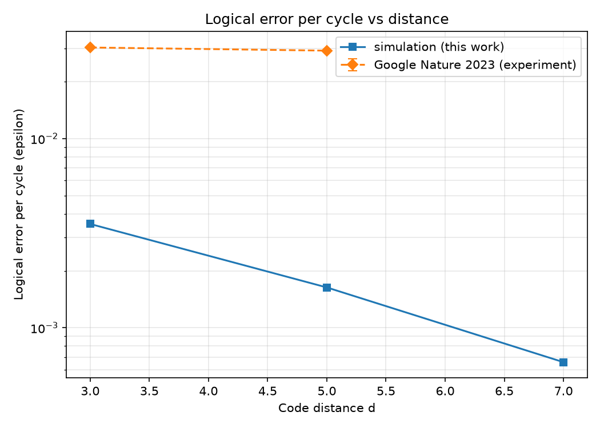
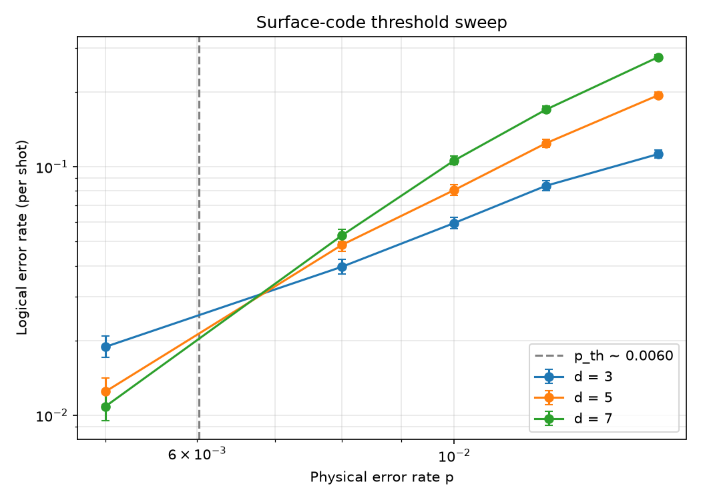

# A Quantum Error Correction Research Portfolio: From Circuit-Level Simulation to Fault-Tolerance Economics

*Andrew Fogelis*

Repository: <https://github.com/afogelis/qec-portfolio>

## Abstract

This document introduces a ten-part software portfolio in quantum error correction (QEC). Its flagship result is an exact, sampling-free measurement of how far the standard minimum-weight perfect matching decoder sits from the provably optimal maximum-likelihood decoder: by enumerating every error pattern of small surface codes, matching is shown to be exactly optimal at distance three and only slightly sub-optimal at distance five. Around that core result the portfolio follows a single technical arc: simulate the surface code at the circuit level, decode it with classical and machine-learning algorithms, make the resulting metrics observable, and use the same physics to estimate the physical-qubit cost of a cryptographically relevant computation. Each component is an independent, installable, tested and continuously integrated Python package; the later components depend on the earlier ones. Further headline results include a circuit-level threshold near 0.6%, a quantitative demonstration that plain belief propagation is dominated on the surface code by matching-based decoders, a calibrated reproduction of the roughly twenty-million-qubit, eight-hour estimate for Shor's algorithm on RSA-2048, and a simulation reproduction of the error-suppression scaling reported by Google in 2023 (suppression factor near 2.2 below threshold). Three further repositories extend the portfolio to the frontier beyond the surface code: a from-scratch builder and BP+OSD decoder for bivariate-bicycle qLDPC codes, a study of biased noise and heralded erasure that reproduces the analytic one-half erasure threshold with a from-scratch peeling decoder, and a fault-tolerant resource compiler that optimises the magic-state factory ratio to minimise spacetime volume.

## Introduction

Quantum error correction is the central engineering obstacle between today's noisy quantum processors and large-scale fault-tolerant computation. The surface code is the leading candidate for near-term hardware because it requires only nearest-neighbour two-qubit gates on a two-dimensional lattice and tolerates a comparatively high physical error rate. Understanding the surface code in depth therefore requires fluency across several disciplines: the physics of stabiliser codes and thresholds, the algorithmics of decoding, the statistics of rare-event estimation, and the software engineering needed to make all of this reproducible.

This portfolio was built to demonstrate that breadth as a coherent body of work rather than as isolated scripts. It is organised as ten independent repositories, the first seven connected by explicit dependencies into a pipeline from first-principles simulation to decision-ready resource estimates, and three further standalone repositories covering qLDPC codes, hardware-realistic noise and fault-tolerant compilation. The remainder of this document summarises the arc, the engineering standards shared across the repositories, and the principal quantitative findings.

## The portfolio

The foundation is surface-code-simulator, a circuit-level Monte Carlo engine built on Stim and PyMatching that constructs surface-code memory experiments, injects noise, extracts syndromes, decodes with minimum-weight perfect matching, and estimates the threshold. decoder-benchmark builds on it to compare matching against from-scratch union-find and belief-propagation decoders on accuracy, runtime and memory. ml-qec-decoder adds machine-learning decoders (random forest, gradient-boosted trees and a neural network) and registers them into the same benchmark for a like-for-like comparison.

qec-dashboard turns the metric artifacts emitted by the simulation and benchmark jobs into an operational dashboard, decoupled from the heavy compute by a small set of JSON data contracts. fault-tolerance-economics propagates physical assumptions through the surface-code suppression law to a physical-qubit, runtime and cost budget for Shor's algorithm on RSA-2048. The two capstones reproduce published research: google-surface-code-reproduction reproduces the methodology and scaling claim of Google's 2023 Nature experiment in simulation, and decoder-accuracy-reproduction reproduces, by exact enumeration, the matching-versus-optimal decoder comparison of Maan and Paler (2023).

*Figure 1. Simulated logical error per cycle versus code distance (this portfolio), shown with Google's published experimental values for context.*

*Figure 2. Surface-code threshold sweep produced by the foundational simulator; the distance curves cross near a physical error rate of 0.6%.*

## Shared engineering practices

Every repository follows the same conventions: a src/ package layout, typed configuration objects validated with Pydantic v2, a receive-an-object / return-an-object interface style, a command-line entry point, a pytest suite, and a GitHub Actions workflow that runs both a ruff lint/format check and the tests across Python 3.10 through 3.13. Randomness is seeded so that reported numbers are reproducible, and the figures in each repository are regenerated from the committed example scripts.

These practices were not cosmetic. Continuous integration on a clean checkout caught a packaging defect that local testing had masked, and the discipline of verifying every citation surfaced and corrected an attribution error in one of the reproduction repositories. The portfolio is intended to read as production-quality research software, not as a notebook dump.

## Key results

The foundational simulator places the circuit-level threshold for uniform depolarising noise near 0.6%, consistent with the accepted range for this noise model, and shows the expected exponential suppression of the logical error rate with code distance below that threshold.

The decoder benchmark confirms the literature consensus that plain belief propagation is dominated on the surface code: in a representative run, minimum-weight perfect matching achieved the lowest mean logical error rate, union-find was close on accuracy at near-linear cost, and belief propagation was worse on both accuracy and runtime. The machine-learning study reaches an honest, calibrated conclusion - learned decoders are competitive with matching at distance three but degrade sharply at distance five under a fixed training budget - rather than overclaiming.

The economics model reproduces the canonical roughly twenty-million-qubit, eight-hour estimate for factoring RSA-2048 with Shor's algorithm, identifies the physical error rate as the dominant cost lever because it enters the required code distance exponentially, and tracks the cost frontier forward to the 2025 state of the art (Gidney, arXiv:2505.15917), which lowers the estimate by roughly twentyfold to under one million physical qubits. The reproduction capstones recover, respectively, an error-suppression factor near 2.2 below threshold and an exact matching sub-optimality that is unity at distance three and grows slowly at distance five.

## Discussion

Taken together, the repositories demonstrate the full loop a QEC researcher works in: building trustworthy simulations, implementing and critically comparing decoders, communicating results, and translating physics into strategic estimates. The deliberate scoping of the reproduction projects - reproducing methodology and qualitative conclusions in simulation rather than claiming to match hardware-calibrated absolute numbers - is itself a demonstration of scientific judgement.

The principal limitation shared across the portfolio is the noise model: a single uniform depolarising rate stands in for the rich, correlated, device-specific noise of real hardware. Natural extensions include biased and correlated noise, leakage, more advanced decoders such as belief propagation with ordered-statistics post-processing or correlated matching, and larger-scale Monte Carlo via parallel samplers. These are the directions in which each repository's future work section points.

## References

- Fowler AG, Mariantoni M, Martinis JM, Cleland AN. Surface codes: Towards practical large-scale quantum computation. Physical Review A 2012; 86:032324.
- Dennis E, Kitaev A, Landahl A, Preskill J. Topological quantum memory. Journal of Mathematical Physics 2002; 43:4452-4505.
- Google Quantum AI. Suppressing quantum errors by scaling a surface code logical qubit. Nature 2023; 614:676-681.
- Gidney C, Ekera M. How to factor 2048 bit RSA integers in 8 hours using 20 million noisy qubits. Quantum 2021; 5:433.
- Gidney C. How to factor 2048 bit RSA integers with less than a million noisy qubits. arXiv:2505.15917, 2025.
- Maan AS, Paler A. Testing the Accuracy of Surface Code Decoders. arXiv:2311.12503, 2023.
- Gidney C. Stim: a fast stabilizer circuit simulator. Quantum 2021; 5:497.
- Higgott O. PyMatching: A Python package for decoding quantum codes with minimum-weight perfect matching. ACM Transactions on Quantum Computing 2022; 3(3):16.
