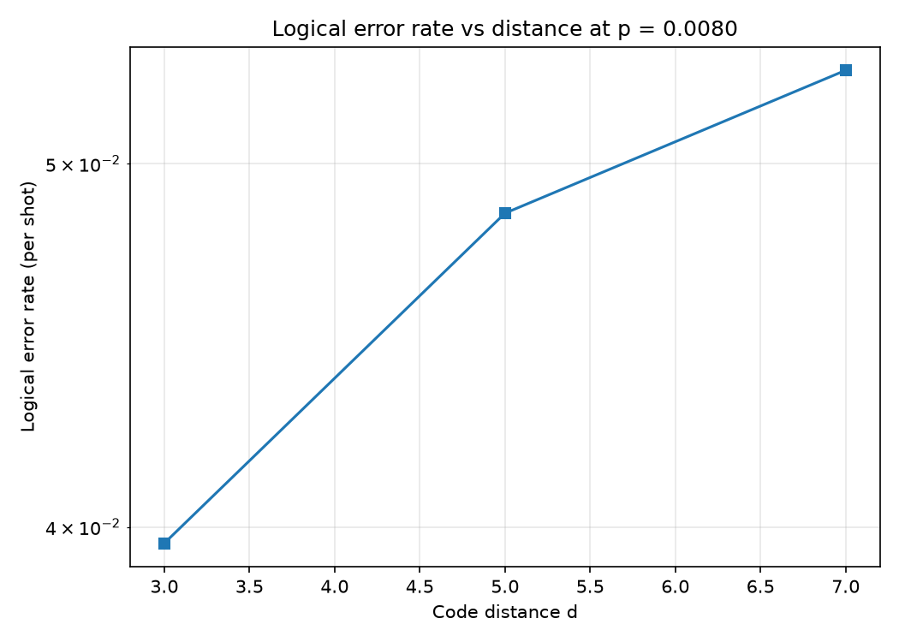

# A Transparent Circuit-Level Surface-Code Memory Simulator with Threshold Estimation

*Andrew Fogelis*

Repository: <https://github.com/afogelis/surface-code-simulator>

## Abstract

A circuit-level Monte Carlo simulator for the surface code was implemented on top of Stim and PyMatching to study the logical performance of the code as a quantum memory. The simulator builds surface-code memory circuits, applies a single physical error rate uniformly across all circuit-level noise channels, samples detection events, decodes them with minimum-weight perfect matching derived from the circuit's detector error model, and tracks logical failures with Wilson confidence intervals. A threshold sweep over code distances three, five and seven and physical error rates between 0.5% and 1.5% located the threshold near 0.6%, below which the logical error rate was suppressed with increasing code distance. The result is consistent with the accepted range for circuit-level depolarising noise and provides a transparent, testable foundation for the rest of the portfolio.

## Introduction

Fault-tolerant quantum computation depends on encoding logical information so that physical errors can be detected and corrected faster than they accumulate. The surface code achieves this with a two-dimensional lattice of data and measure qubits requiring only local interactions, and it tolerates a relatively high physical error rate, which makes it the leading code for superconducting and neutral-atom hardware. The central figure of merit is the threshold: the physical error rate below which increasing the code distance reduces the logical error rate.

Many high-quality libraries exist for stabiliser simulation and decoding, but a researcher benefits from a compact, end-to-end pipeline whose statistics are easy to read and test. This work was undertaken to build such a pipeline and to verify that it recovers the textbook threshold behavior, establishing a trustworthy base layer on which decoder comparisons, machine-learning experiments and paper reproductions could be built.

## Materials and Methods

Surface-code memory circuits were generated with Stim's circuit generator, which exposes a single physical error rate that drives every circuit-level noise channel, including two-qubit gate depolarisation, reset and measurement flips, and idle depolarisation. Detection events were sampled with Stim's detector sampler. The detector error model of each circuit was converted into a matching graph and decoded with PyMatching's implementation of minimum-weight perfect matching; a shot was counted as a logical failure when the decoded correction disagreed with the recorded logical observable.

Logical error rates were reported with Wilson score confidence intervals, which behave correctly for the small failure counts encountered well below threshold, and a per-round logical error rate was derived to compare runs with different round counts. The threshold sweep ran code distances three, five and seven at physical error rates of 0.5%, 0.8%, 1.0%, 1.2% and 1.5% with twenty thousand shots per point and a fixed random seed. Configuration was expressed with typed Pydantic models, and the pipeline was covered by unit and end-to-end tests exercising the real Stim and PyMatching stack.

## Results

The threshold sweep produced the characteristic crossing of logical-error curves for different code distances. The estimated crossing fell at a physical error rate of approximately 0.60%. Below the crossing, larger code distances produced lower logical error rates; above it, the ordering reversed, as expected when the code can no longer keep pace with the physical noise.

At a fixed below-threshold physical error rate of 0.8%, the logical error rate fell steeply with code distance, displaying the exponential suppression that is the defining benefit of the surface code. The Wilson intervals were narrow enough at twenty thousand shots to make the ordering of the distance curves unambiguous around the crossing region.

*Figure 1. Logical error rate versus physical error rate for code distances three, five and seven. The curves cross near a physical error rate of 0.6%, marking the threshold.*

*Figure 2. Logical error rate versus code distance at a fixed below-threshold physical error rate of 0.8%, showing exponential suppression.*

## Discussion

The measured threshold near 0.6% sits within the accepted range for circuit-level depolarising noise decoded with matching, which validates the simulator against established results. The clean exponential suppression with distance confirms that the noise injection, detector sampling and decoding are wired together correctly.

The simulator's main simplification is its use of a single uniform depolarising rate, which omits the biased, correlated and leakage-driven noise present in hardware; absolute thresholds for real devices therefore differ. The single-process sweep also trades raw throughput for transparency. Natural extensions include parallelised sampling for larger sweeps, biased-noise channels, and alternative decoders, the last of which is addressed directly by the companion decoder-benchmark repository.

## References

- Fowler AG, Mariantoni M, Martinis JM, Cleland AN. Surface codes: Towards practical large-scale quantum computation. Physical Review A 2012; 86:032324.
- Dennis E, Kitaev A, Landahl A, Preskill J. Topological quantum memory. Journal of Mathematical Physics 2002; 43:4452-4505.
- Gidney C. Stim: a fast stabilizer circuit simulator. Quantum 2021; 5:497.
- Higgott O. PyMatching: A Python package for decoding quantum codes with minimum-weight perfect matching. ACM Transactions on Quantum Computing 2022; 3(3):16.
- Kitaev AY. Fault-tolerant quantum computation by anyons. Annals of Physics 2003; 303:2-30.
