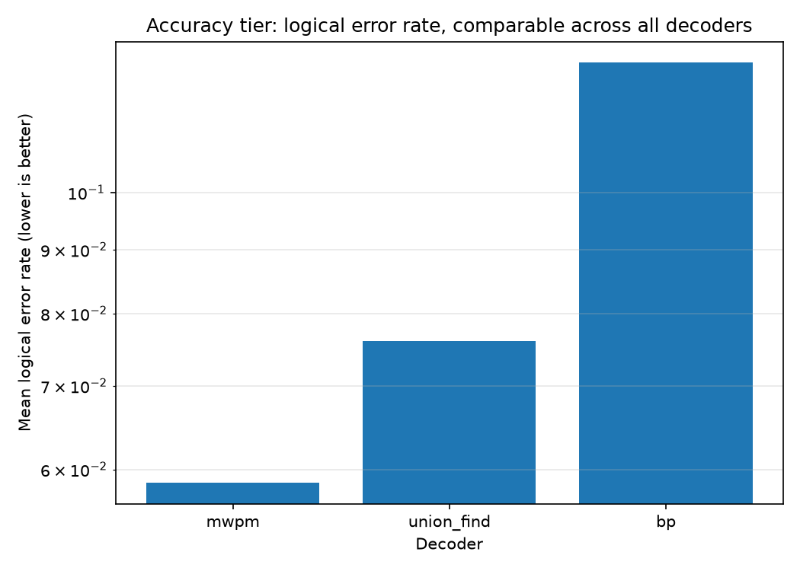
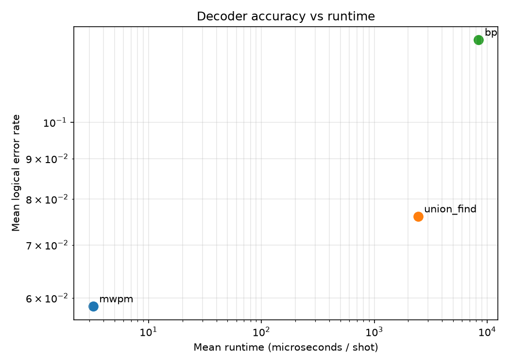
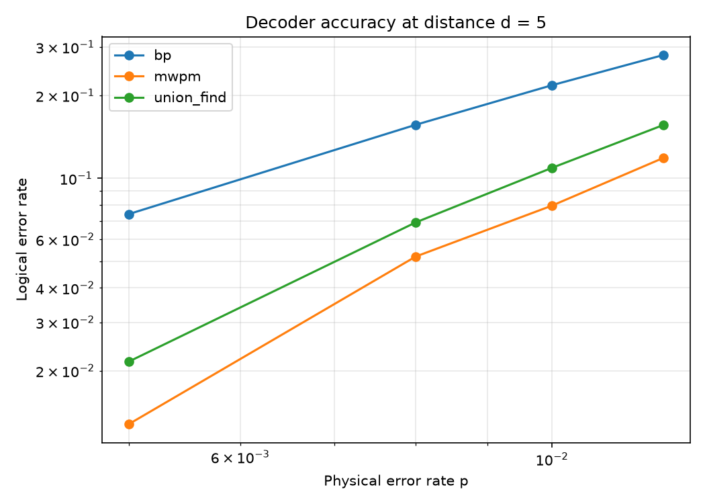

# Benchmarking Surface-Code Decoders: Minimum-Weight Matching, Union-Find and Belief Propagation

*Andrew Fogelis*

Repository: <https://github.com/afogelis/decoder-benchmark>

## Abstract

A benchmarking framework was developed to compare surface-code decoders on a level playing field, reporting accuracy and runtime as two separate tiers so that algorithm quality is never conflated with implementation language. Minimum-weight perfect matching (via PyMatching) was compared against from-scratch implementations of a union-find decoder and a log-domain belief-propagation decoder, with an optional ordered-statistics decoder (BP-OSD, via the ldpc package) as a compiled reference. Across code distances three and five and physical error rates between 0.5% and 1.2%, matching achieved the lowest mean logical error rate and union-find was close on accuracy, while plain belief propagation was the least accurate. Runtime was compared only within an implementation backend, because a pure-Python decoder cannot be meaningfully timed against compiled C++. The framework reproduces the consensus of the decoder literature and exposes, by implementing the algorithms directly, why each behaves as it does.

## Introduction

A decoder maps the syndrome produced by a quantum error-correcting code to a correction. Its quality determines how close a code operates to its theoretical threshold, and its speed determines whether decoding can keep pace with the measurement cycle in real time. The surface code admits several decoding strategies with different accuracy and latency trade-offs, so a fair comparison framework is valuable both pedagogically and practically.

This work implemented union-find and belief-propagation decoders from scratch, rather than calling compiled libraries, so that the benchmark could illuminate the algorithmic reasons behind each decoder's performance instead of treating it as a black box. Matching, the community-standard accuracy reference, was included through the established PyMatching library.

## Materials and Methods

The detector error model emitted by each surface-code circuit was converted into parity-check and observable matrices shared by every decoder, ensuring that all decoders saw identical syndrome batches. Matching was performed with PyMatching. The union-find decoder implemented the Delfosse-Nickerson cluster-growth algorithm with spanning-forest peeling on the matching graph, which runs in almost-linear time. The belief-propagation decoder implemented the log-domain sum-product algorithm on the detector error model.

Each decoder was profiled for accuracy (logical error rate), runtime (microseconds per shot) and peak memory (via allocation tracking) over the same shots. Runs were summarized in a ranked leaderboard and an accuracy-versus-runtime Pareto frontier. The reported configuration covered code distances three and five at physical error rates of 0.5%, 0.8%, 1.0% and 1.2% with five thousand shots per point and a fixed seed.

## Results

On the accuracy tier, which is comparable across all decoders because they decode identical syndromes, minimum-weight perfect matching achieved the best mean logical error rate, union-find was close behind, and plain belief propagation was the least accurate. This ordering is the scientific result and is independent of implementation language.

On the runtime tier, comparisons were made only within an implementation backend. Within the pure-Python tier, union-find was both more accurate and faster than belief propagation while using markedly less memory, consistent with its near-linear design. The compiled matching routine was far faster than either pure-Python decoder, but that gap reflects the language rather than the algorithm and is therefore not presented as a like-for-like result.

The accuracy-versus-physical-error-rate curves at distance five reproduced the expected ordering across the full range of physical error rates studied, with matching and union-find defining the accuracy frontier and belief propagation trailing.

*Figure 1. Accuracy tier: mean logical error rate per decoder, comparable across all because they decode identical syndromes. Plain belief propagation is the least accurate.*

*Figure 2. Runtime tier: accuracy versus runtime, with points grouped by implementation backend. The runtime axis is comparable only within a backend.*

*Figure 3. Logical error rate versus physical error rate at code distance five for each decoder.*

## Discussion

That plain belief propagation is dominated on the surface code is a known result, and reproducing it from a direct implementation clarifies the cause: the surface-code factor graph is highly degenerate and rich in short cycles, which prevents the message-passing iteration from converging to the correct marginal in the way it does for the sparse, loop-poor graphs of classical low-density parity-check codes. Belief propagation becomes competitive only when augmented with ordered-statistics post-processing; an optional BP-OSD decoder backed by the ldpc package is provided as a compiled reference to make exactly this point, so that the weakness of plain belief propagation is not mistaken for a weakness of belief propagation as a family.

Union-find's strong accuracy at near-linear theoretical cost makes it attractive for real-time decoding; the runtime gap observed here reflects the pure-Python implementation rather than the algorithm itself, which is why runtime is reported only within an implementation backend. Future work includes correlated matching and compiling the union-find inner loop. The machine-learning decoders evaluated in the companion repository register into this same framework for direct comparison.

## References

- Dennis E, Kitaev A, Landahl A, Preskill J. Topological quantum memory. Journal of Mathematical Physics 2002; 43:4452-4505.
- Delfosse N, Nickerson NH. Almost-linear time decoding algorithm for topological codes. Quantum 2021; 5:595.
- Higgott O. PyMatching: A Python package for decoding quantum codes with minimum-weight perfect matching. ACM Transactions on Quantum Computing 2022; 3(3):16.
- Fowler AG, Mariantoni M, Martinis JM, Cleland AN. Surface codes: Towards practical large-scale quantum computation. Physical Review A 2012; 86:032324.
- Gidney C. Stim: a fast stabilizer circuit simulator. Quantum 2021; 5:497.
