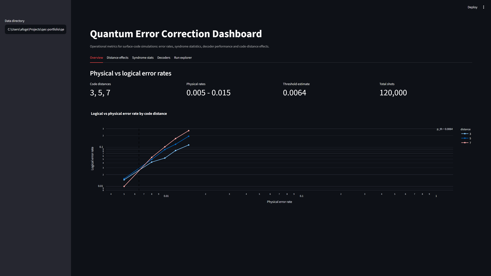

# An Observability Dashboard for Surface-Code Simulation Metrics

*Andrew Fogelis*

Repository: <https://github.com/afogelis/qec-dashboard>

## Abstract

An operational dashboard was built to make the metrics produced by surface-code simulation and decoder-benchmark jobs observable in the way an operations team would monitor a production system. Implemented with Streamlit, the dashboard consumes a small set of JSON artifacts - threshold sweeps, decoder leaderboards and syndrome statistics - through explicit data contracts, so that it remains decoupled from the heavy simulation stack. It presents physical-versus-logical error rates by code distance, code-distance effects, per-detector syndrome statistics, decoder performance and a raw run explorer, and ships with bundled sample data so that it runs with no simulations required.

## Introduction

Simulation and benchmarking produce numbers; turning those numbers into decision-ready views is a separate skill. In operational settings, dashboards consume metrics emitted by upstream pipelines rather than recomputing them, which keeps the presentation layer quick to deploy and isolated from changes in the compute layer. This work applied that pattern to quantum error correction.

The goal was a dashboard that an error-correction operations team would actually watch, surfacing the quantities that indicate whether a code is operating below threshold and which decoder is performing best, while remaining independent of the simulators that generate the data.

## Materials and Methods

The dashboard depends only on a set of JSON schemas describing three artifacts: a threshold sweep, a decoder benchmark and a syndrome-statistics summary. Loader functions parse these artifacts into tabular frames, and the interface was implemented as a set of Streamlit tabs. Because the contract is the JSON schema rather than the simulation code, the dashboard installs and runs without the simulation dependencies.

Sample artifacts were bundled with the application so that it works out of the box; an optional generator regenerates them from the upstream simulator and benchmark packages. Loader behavior was covered by unit tests.

## Results

The dashboard presents five views: an overview of physical-versus-logical error rates by code distance with the threshold marked, a code-distance-effects view of logical error rate versus distance at a chosen physical rate, per-detector syndrome firing statistics, a decoder-performance view combining the leaderboard and the accuracy/runtime trade-off, and a run explorer for filtering and exporting raw records. Running on the bundled sample data, the overview reproduces the threshold crossing and distance ordering from the underlying simulator.

*Figure 1. The dashboard overview tab running on bundled sample data: summary metrics and logical-versus-physical error-rate curves by code distance, with the estimated threshold marked.*

## Discussion

Separating presentation from computation through a small data contract is a common pattern in production observability stacks; here it improves deployability and testing speed. The dashboard is read-only and static; it visualizes completed runs rather than streaming live results.

Future work includes streaming metrics from long-running sweeps, alerting when an operating point drifts above threshold, and richer cross-filtering across decoders and code distances. The data contract makes such extensions additive rather than invasive.

## References

- Fowler AG, Mariantoni M, Martinis JM, Cleland AN. Surface codes: Towards practical large-scale quantum computation. Physical Review A 2012; 86:032324.
- Gidney C. Stim: a fast stabilizer circuit simulator. Quantum 2021; 5:497.
- Higgott O. PyMatching: A Python package for decoding quantum codes with minimum-weight perfect matching. ACM Transactions on Quantum Computing 2022; 3(3):16.
- Google Quantum AI. Suppressing quantum errors by scaling a surface code logical qubit. Nature 2023; 614:676-681.
