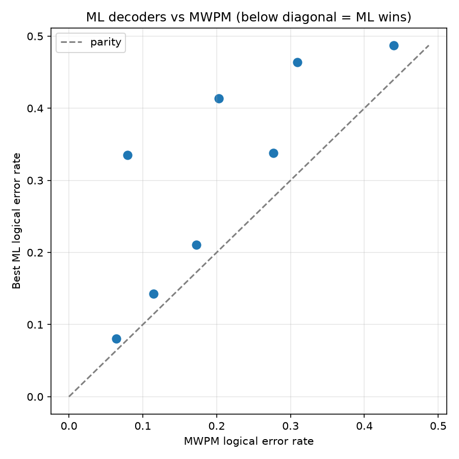

# Machine-Learning Decoders for the Surface Code: A Regime Analysis against Minimum-Weight Perfect Matching

*Andrew Fogelis*

Repository: <https://github.com/afogelis/ml-qec-decoder>

## Abstract

Three machine-learning decoders for the surface code - a random forest, a gradient-boosted tree ensemble and a feed-forward neural network - were implemented and compared head-to-head with minimum-weight perfect matching. Each model learns to predict the logical observable flip directly from a syndrome and plugs into the decoder-benchmark framework for a like-for-like comparison. Across code distances three and five and physical error rates between 1% and 3% with a fixed training budget, the learned decoders were competitive with matching at distance three - the neural network reached a logical error rate of 0.080 against matching's 0.064 at a physical rate of 1% - but degraded sharply at distance five. The study reaches a calibrated conclusion about when learned decoding helps rather than overclaiming that it beats matching.

## Introduction

Machine-learning decoders are an active research direction for quantum error correction, motivated by the hope that a learned model can capture noise correlations that hand-designed decoders ignore. Early neural decoders showed promise on small codes, and the question of when learning helps remains practically important.

This work framed decoding as supervised classification from syndrome to logical flip and asked a focused question: under a fixed, realistic training budget and the same circuit-level depolarising noise used elsewhere in the portfolio, in which regimes do learned decoders match or beat minimum-weight perfect matching, and where do they fail?

## Materials and Methods

Three models were implemented behind a common base class: a random forest and a gradient-boosted tree ensemble, and a feed-forward neural network trained with binary cross-entropy loss, the Adam optimiser and early stopping on a validation split. Training data were sampled from the same Stim circuits the classical decoders see, so the comparison is apples-to-apples, and the models were registered into the decoder-benchmark framework to be scored identically.

The reported sweep covered code distances three and five at physical error rates of 1%, 1.5%, 2% and 3%, with twenty thousand training shots and five thousand evaluation shots at a fixed seed. Minimum-weight perfect matching was evaluated on the same shots as the reference.

## Results

At code distance three the learned decoders were competitive with matching. The neural network achieved a logical error rate of 0.080 against matching's 0.064 at a physical error rate of 1%, and the gap closed further with additional training data; inference was sub-microsecond per shot because a forward pass is a few matrix multiplications. At code distance five every learned decoder degraded markedly - for example the best learned decoder reached 0.335 against matching's 0.080 at a physical rate of 1% - because the syndrome space grows, logical flips become rarer, and a fixed training budget no longer covers the input distribution.

Across all regimes matching won, but the margin and the reasons varied with distance and physical error rate, producing a clear regime map rather than a single verdict.

*Figure 1. Logical error rate of matching versus the best machine-learning decoder, across code distance and physical error rate. The learned decoders approach matching at distance three and low physical rates, then fall behind at distance five.*

## Discussion

For circuit-level depolarising noise the matching graph is an excellent model of the error process, so a learned decoder is competing against a near-optimal baseline; matching also exploits the known error model rather than having to learn it from data. The honest conclusion is therefore not that machine learning beats matching, but that it is competitive only where the matching graph is a poor model - strongly correlated or non-graphlike noise - or where training data are abundant relative to the code distance.

The fixed training budget is the central limitation; performance at distance five is data-starved by construction. Future work includes scaling training data with distance, convolutional and graph-neural architectures that exploit lattice locality, and evaluation under correlated and leakage noise where learned models are most likely to add value.

## References

- Torlai G, Melko RG. Neural decoder for topological codes. Physical Review Letters 2017; 119:030501.
- Varsamopoulos S, Criger B, Bertels K. Decoding small surface codes with feedforward neural networks. Quantum Science and Technology 2018; 3:015004.
- Higgott O. PyMatching: A Python package for decoding quantum codes with minimum-weight perfect matching. ACM Transactions on Quantum Computing 2022; 3(3):16.
- Fowler AG, Mariantoni M, Martinis JM, Cleland AN. Surface codes: Towards practical large-scale quantum computation. Physical Review A 2012; 86:032324.
- Gidney C. Stim: a fast stabilizer circuit simulator. Quantum 2021; 5:497.
