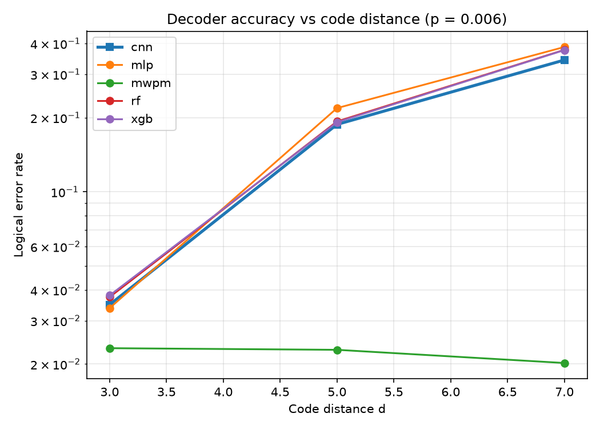

# When Learned Decoders Fail against Matching: A Controlled Negative Study on the Surface Code

*Andrew Fogelis*

Repository: <https://github.com/afogelis/ml-qec-decoder>

## Abstract

Four machine-learning decoders for the surface code - a random forest, a gradient-boosted tree ensemble, a feed-forward neural network and a geometry-aware convolutional network that reshapes the syndrome back onto its lattice - were implemented and compared head-to-head with minimum-weight perfect matching. Each model learns to predict the logical observable flip directly from a syndrome and plugs into the decoder-benchmark framework for a like-for-like comparison. The study was designed to test honestly whether learned decoders keep up with matching as the code grows. Under a fixed, realistic training budget the answer is that they do not: the learned decoders were competitive with matching only at distance three, and at distances five and seven every model, including the convolutional one, diverged upward in logical error rate while matching continued to suppress it. The geometry-aware inductive bias of the convolutional model bought only a marginal edge over the tabular models and did not prevent the collapse. The result is reported as a calibrated negative finding about when learned decoding is the wrong tool, rather than a cherry-picked win.

## Introduction

Machine-learning decoders are an active research direction for quantum error correction, motivated by the hope that a learned model can capture noise correlations that hand-designed decoders ignore. Early neural decoders showed promise on small codes, and the question of when learning helps remains practically important.

This work framed decoding as supervised classification from syndrome to logical flip and asked a focused question: under a fixed, realistic training budget and the same circuit-level depolarising noise used elsewhere in the portfolio, in which regimes do learned decoders match or beat minimum-weight perfect matching, and where do they fail?

## Materials and Methods

Four models were implemented behind a common base class: a random forest and a gradient-boosted tree ensemble; a feed-forward neural network trained with binary cross-entropy loss, the Adam optimizer and early stopping on a validation split; and a geometry-aware convolutional network. The convolutional model recovers each detector's lattice coordinate from the Stim circuit, scatters the binary detection events into a time-by-height-by-width image, and applies small convolutional kernels, giving it the translation-equivariant inductive bias appropriate to a two-dimensional code. Training data were sampled from the same Stim circuits the classical decoders see, so the comparison is apples-to-apples, and all models were registered into the decoder-benchmark framework to be scored identically.

Two sweeps were run. A regime sweep covered code distances three and five at physical error rates of 1%, 1.5%, 2% and 3% with twenty thousand training and five thousand evaluation shots. A scaling sweep covered code distances three, five and seven at a fixed below-threshold physical error rate of 0.6% with thirty thousand training shots, in order to isolate how each decoder scales with code size. Minimum-weight perfect matching was evaluated on the same shots as the reference throughout.

## Results

At code distance three the learned decoders were competitive with matching. The neural network achieved a logical error rate of 0.080 against matching's 0.064 at a physical error rate of 1%, and inference was sub-microsecond per shot because a forward pass is a few matrix multiplications. This was the only regime in which learned decoding was in contention.

The scaling sweep made the failure unambiguous. As the code distance grew from three to seven at a fixed physical error rate of 0.6%, matching suppressed its logical error rate, holding near 0.02, while every learned decoder diverged upward to roughly 0.35 at distance seven. The growth of the syndrome space and the rarity of logical flips left the fixed training budget unable to cover the input distribution. The geometry-aware convolutional model was consistently the best of the learned decoders at distances five and seven, confirming that its lattice inductive bias helps, but the margin over the tabular models was small and it diverged from matching by roughly an order of magnitude all the same.

*Figure 1. Logical error rate versus code distance at a fixed physical error rate of 0.6% for matching and the four learned decoders. Matching suppresses the logical error rate while every learned decoder, including the convolutional one, diverges upward.*

*Figure 2. Logical error rate of matching versus the best machine-learning decoder across code distance and physical error rate. Points above the diagonal are matching wins; learned decoders only approach the diagonal at distance three and low physical rates.*

## Discussion

For circuit-level depolarising noise the matching graph is an excellent model of the error process, so a learned decoder is competing against a near-optimal baseline; matching also exploits the known error model rather than having to learn it from data. The honest conclusion is therefore not that machine learning beats matching, but that it is competitive only where the matching graph is a poor model - strongly correlated or non-graphlike noise - or where training data are abundant relative to the code distance.

That even the geometry-aware convolutional model fails to track matching is the most informative part of the study: the right architecture does not substitute for the missing data when logical failures are exponentially rare at large distance. The fixed training budget is the central limitation, and it is the realistic one. Future work includes scaling training data with distance, graph-neural architectures that exploit lattice locality more directly, and evaluation under correlated and leakage noise where learned models are most likely to add value.

## References

- Torlai G, Melko RG. Neural decoder for topological codes. Physical Review Letters 2017; 119:030501.
- Varsamopoulos S, Criger B, Bertels K. Decoding small surface codes with feedforward neural networks. Quantum Science and Technology 2018; 3:015004.
- Higgott O. PyMatching: A Python package for decoding quantum codes with minimum-weight perfect matching. ACM Transactions on Quantum Computing 2022; 3(3):16.
- Fowler AG, Mariantoni M, Martinis JM, Cleland AN. Surface codes: Towards practical large-scale quantum computation. Physical Review A 2012; 86:032324.
- Gidney C. Stim: a fast stabilizer circuit simulator. Quantum 2021; 5:497.
