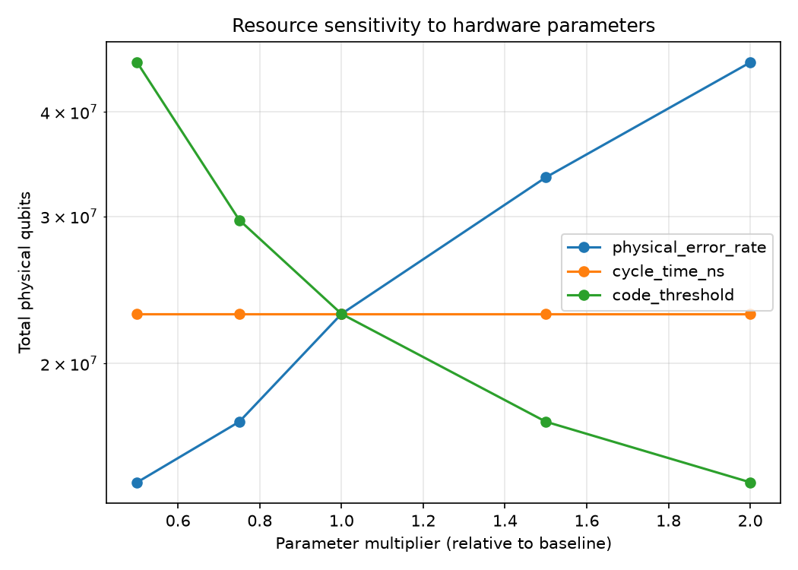
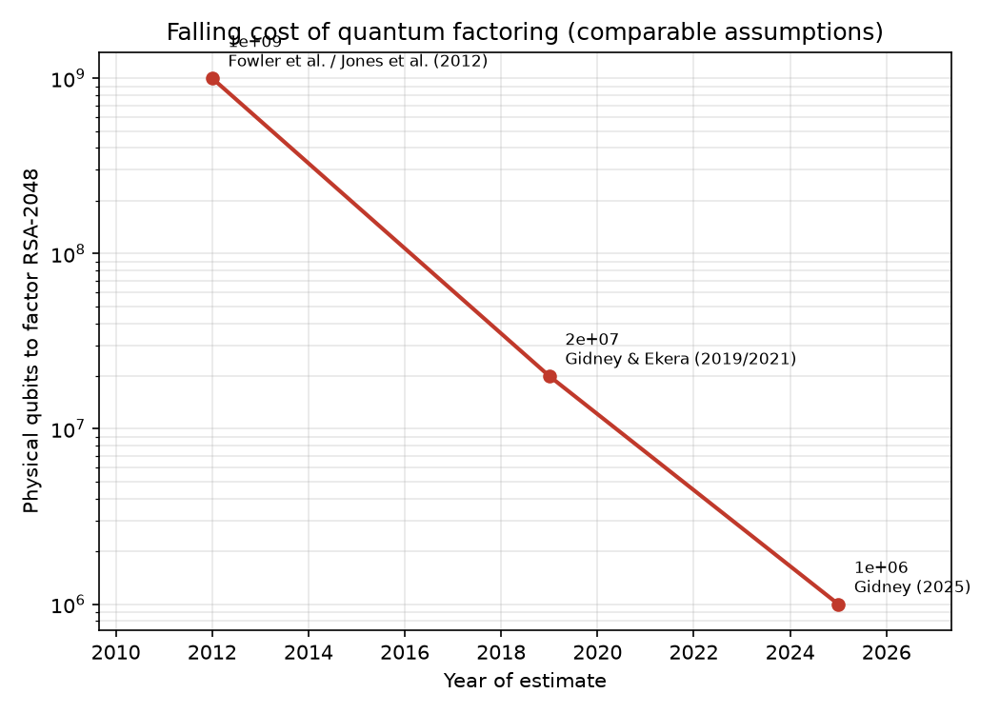

# Physical-Qubit and Runtime Economics of Shor's Algorithm on RSA-2048

*Andrew Fogelis*

Repository: <https://github.com/afogelis/fault-tolerance-economics>

## Abstract

A transparent resource and cost model was developed to estimate the physical qubits, runtime and cost required to run Shor's algorithm against RSA-2048 under realistic error-correction overhead. Logical resource requirements were taken from the literature and propagated through the surface-code suppression law to fix the code distance, the per-patch physical-qubit footprint and the total runtime. Calibrated to the canonical estimate of Gidney and Ekera (2021), a baseline superconducting profile yielded roughly twenty-three million physical qubits at code distance twenty-nine and a runtime of about seven to eight hours. A sensitivity analysis identified the physical error rate as the dominant cost lever, because it enters the required code distance exponentially. A historical-frontier extension reproduces the 2025 state of the art (Gidney, arXiv:2505.15917), which lowers the estimate to under one million physical qubits - an approximately twentyfold reduction under identical hardware assumptions - and attributes the improvement to approximate residue arithmetic, yoked surface codes and magic state cultivation.

## Introduction

The security of widely deployed public-key cryptography rests on the classical hardness of factoring. Shor's algorithm would break RSA on a sufficiently large fault-tolerant quantum computer, so the physical-resource cost of running it is a question of direct strategic interest. That cost is dominated not by the logical algorithm but by the error-correction overhead needed to execute it reliably.

This work built a transparent model that turns explicit physical assumptions into a physical-qubit, runtime and cost budget, with the aim of reproducing the canonical published estimate and exposing which assumptions matter most.

## Materials and Methods

Logical resource requirements - the number of algorithmic logical qubits and the Toffoli count for Shor on RSA-2048, together with a factory and routing multiplier - were taken from Gidney and Ekera (2021). The surface-code overhead was modeled with the standard suppression law, in which the logical error per patch scales as roughly one tenth of the ratio of physical to threshold error rate raised to the power of half the distance plus one; a total error budget fixed the required code distance, and a rotated patch was costed at twice the distance squared minus one physical qubits.

Runtime was estimated as the Toffoli count multiplied by a per-Toffoli time, calibrated so that the baseline profile reproduced the published figure. Hardware assumptions were captured in typed profiles, and a sensitivity sweep varied the physical error rate, cycle time and threshold to produce optimistic, baseline and conservative scenarios.

## Results

The baseline superconducting profile - a physical error rate of one in a thousand, a one-microsecond surface-code cycle and a one-percent threshold - yielded approximately twenty-three million physical qubits at code distance twenty-nine, running for about seven and a half hours, in line with the canonical roughly twenty-million-qubit, eight-hour estimate. An optimistic profile reduced the requirement to under ten million qubits at distance nineteen, while a conservative profile raised it above eighty million qubits at distance fifty-five.

The sensitivity analysis showed that the physical error rate dominates the budget: because it enters the required distance exponentially, modest improvements in physical fidelity translate into large reductions in physical-qubit count, far outweighing changes in cycle time or the assumed threshold.

Extending the model across published estimates reproduced the falling cost of quantum factoring under comparable assumptions: from roughly one billion physical qubits (2012), to twenty million (Gidney and Ekera, 2019), to under one million (Gidney, 2025) - an approximately twentyfold reduction over the 2019 figure. The 2025 headline was reconstructed from its reported components rather than re-derived: cold yoked storage (1,280 logical qubits at 430 physical qubits each), hot storage (131 logical qubits at 1,352 each) and a compute region of 126 patches summed to 897,864 physical qubits, which the source rounds up to one million for slack. The reduction was attributed to three techniques: approximate residue arithmetic (fewer logical qubits), yoked surface codes (about threefold denser idle storage) and magic state cultivation (smaller distillation factories); the Toffoli count rose from about three billion to about 6.5 billion, a deliberate trade of time for space.

*Figure 1. Sensitivity of the physical-qubit estimate to each modeling assumption. The physical error rate dominates because it enters the required code distance exponentially.*

*Figure 2. Historical physical-qubit cost of factoring RSA-2048 under comparable hardware assumptions: about one billion qubits (2012), twenty million (2019), and one million (2025).*

## Discussion

Reproducing the canonical estimate from an independent, transparent model increases confidence in both the estimate and the model, and the dominance of the physical error rate clarifies where hardware effort yields the greatest leverage. The exercise also illustrates translating a physics result into a decision-ready figure with explicit, inspectable assumptions.

The model is deliberately simplified: it abstracts magic-state distillation, routing congestion and lattice-surgery scheduling into multipliers and a calibrated per-Toffoli time rather than modeling them in detail. Future work includes an explicit distillation-factory model, a scheduling-aware runtime estimate, and profiles for additional hardware modalities such as neutral atoms and trapped ions.

## References

- Shor PW. Algorithms for quantum computation: discrete logarithms and factoring. Proceedings 35th Annual Symposium on Foundations of Computer Science 1994; 124-134.
- Gidney C, Ekera M. How to factor 2048 bit RSA integers in 8 hours using 20 million noisy qubits. Quantum 2021; 5:433.
- Gidney C. How to factor 2048 bit RSA integers with less than a million noisy qubits. arXiv:2505.15917, 2025.
- Chevignard C, Fouque P-A, Schrottenloher A. Reducing the Number of Qubits in Quantum Factoring. Cryptology ePrint Archive, Paper 2024/222, 2024.
- Gidney C, Newman M, Brooks P, Jones C. Yoked surface codes. Nature Communications 2025.
- Gidney C, Shutty N, Jones C. Magic state cultivation: growing T states as cheap as CNOT gates. arXiv:2409.17595, 2024.
- Fowler AG, Mariantoni M, Martinis JM, Cleland AN. Surface codes: Towards practical large-scale quantum computation. Physical Review A 2012; 86:032324.
- Kitaev AY. Fault-tolerant quantum computation by anyons. Annals of Physics 2003; 303:2-30.
