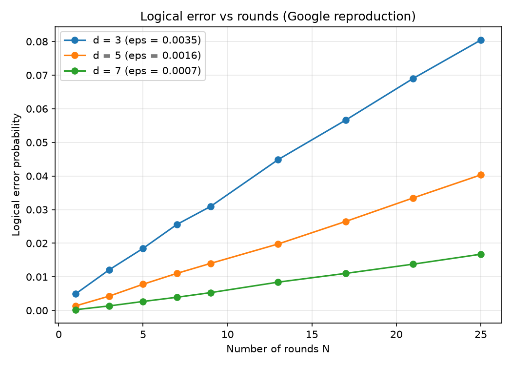

# Reproducing the Scaling Logic of Google's 2023 Surface-Code Experiment in Simulation

*Andrew Fogelis*

Repository: <https://github.com/afogelis/google-surface-code-reproduction>

## Abstract

The central scaling claim of Google Quantum AI's 2023 experiment - that below threshold, increasing the surface-code distance suppresses the logical error per cycle - was reproduced in simulation. Logical error per cycle was extracted by fitting the decay of logical fidelity with the number of error-correction rounds, using the portfolio's Stim and matching simulator, for code distances three, five and seven at a representative below-threshold physical error rate. The simulation reproduced the qualitative suppression with an error-suppression factor near 2.2 between successive distances. Consistent with honest scoping, device-specific absolute error rates were not reproduced, because a single uniform depolarising model was used in place of Google's calibrated per-component noise; the published values are shown only for context.

## Introduction

In 2023 Google Quantum AI reported the first experimental demonstration that a larger surface code can have a lower logical error rate than a smaller one, a milestone for the field because it showed error suppression by scaling on real hardware. The result is naturally summarized by a suppression factor relating the logical error per cycle at successive code distances.

A full hardware reproduction is impossible without the device, so this work set out to reproduce the experiment's analysis methodology and its qualitative physics conclusion in simulation, and to be explicit about the boundary between what simulation can and cannot reproduce.

## Materials and Methods

The logical error per cycle was extracted by fitting the relation that one minus twice the failure probability after a given number of rounds equals one minus twice the per-cycle logical error, raised to the power of the round count. The failure probability as a function of round count was measured with the portfolio's Stim and matching simulator. Code distances three, five and seven were run at a representative below-threshold physical error rate of 0.4%. A weighted mean of representative published component error rates was used to place the simplified uniform model near the experiment's operating regime.

## Results

The extracted logical error per cycle fell monotonically with code distance, from approximately 0.0035 at distance three to 0.0016 at distance five and 0.0007 at distance seven. The corresponding error-suppression factors were approximately 2.2 between distances three and five and 2.3 between distances five and seven, reproducing the experiment's central claim that increasing the code distance suppresses the logical error per cycle below threshold.

The published experimental values, near three percent per cycle, were plotted alongside the simulation for context. As expected, the absolute simulated values differ from the hardware values, since the simulation uses uniform depolarising noise rather than the device's calibrated, correlated noise.

*Figure 1. Logical error versus number of error-correction rounds for code distances three, five and seven; the per-cycle logical error is fit from each decay curve.*

*Figure 2. Simulated logical error per cycle versus code distance, with Google's published experimental values overlaid for context. Below threshold the simulated value falls with distance.*

## Discussion

The simulation reproduces the qualitative result that matters - error suppression by scaling - and recovers a suppression factor in the same range as the experiment. The deliberate decision not to claim reproduction of the absolute numbers is the scientifically honest position: matching hardware-calibrated values would require the device's detailed noise model, which is not available in this setting.

Limitations include the uniform depolarising noise model, the omission of leakage, crosstalk and non-Markovian effects present in hardware, and the use of matching as the sole decoder. Future work includes substituting a calibrated component-wise noise model and studying the more advanced decoders the experiment also considered.

## References

- Google Quantum AI. Suppressing quantum errors by scaling a surface code logical qubit. Nature 2023; 614:676-681.
- Fowler AG, Mariantoni M, Martinis JM, Cleland AN. Surface codes: Towards practical large-scale quantum computation. Physical Review A 2012; 86:032324.
- Gidney C. Stim: a fast stabilizer circuit simulator. Quantum 2021; 5:497.
- Higgott O. PyMatching: A Python package for decoding quantum codes with minimum-weight perfect matching. ACM Transactions on Quantum Computing 2022; 3(3):16.
