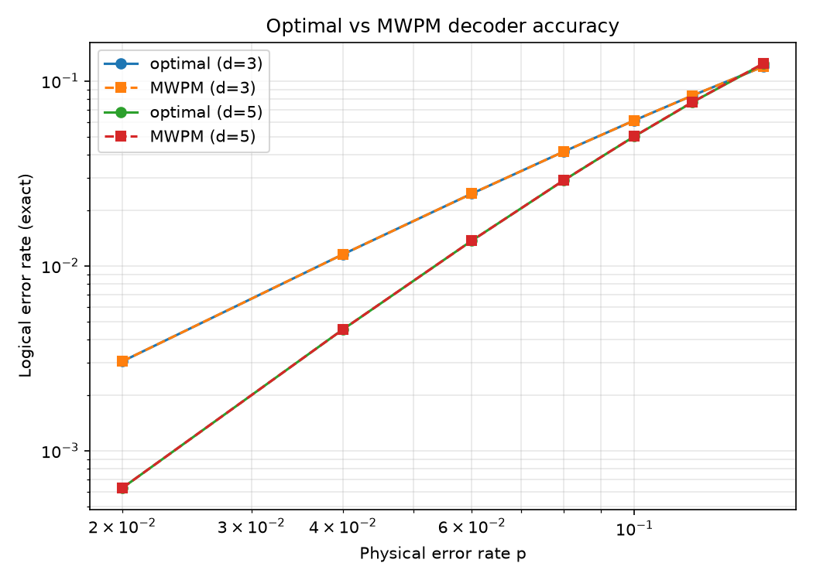
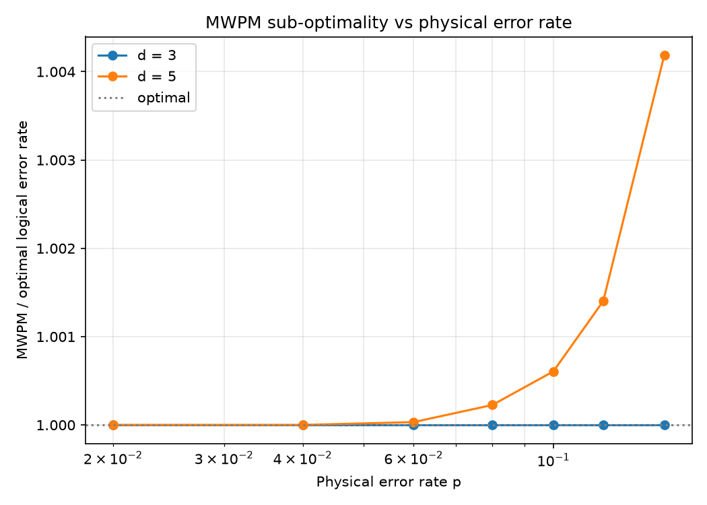

# Exact Sub-Optimality of Minimum-Weight Perfect Matching versus Maximum-Likelihood Decoding

*Andrew Fogelis*

Repository: <https://github.com/afogelis/decoder-accuracy-reproduction>

## Abstract

The methodology of Maan and Paler (2023), which compares practical decoders against an exact reference, was reproduced by enumerating every error pattern of small surface codes in the code-capacity model. Because the number of independent error mechanisms is small at low distance, the logical error rate of any decoder can be computed exactly without Monte Carlo sampling. The optimal maximum-likelihood decoder, which selects the most probable logical class per syndrome, sets a hard lower bound; minimum-weight perfect matching was evaluated against it. Matching was found to be exactly optimal at code distance three across all physical error rates studied, and to develop a small, growing sub-optimality at distance five, reaching a factor of about 1.004 at a physical error rate of fifteen percent.

## Introduction

Every practical decoder trades accuracy for speed, but quantifying that trade-off requires a reference of known quality. The optimal decoder for a given code and noise model is the maximum-likelihood decoder, which chooses the most probable logical class consistent with the observed syndrome; its logical error rate is a hard lower bound that no decoder can beat.

Maan and Paler (2023) compared matching and belief propagation against exhaustive look-up tables for surface codes up to distance seven. This work reproduced the core of that methodology by exact enumeration on small code-capacity instances, in order to measure precisely how far matching sits from optimal and how that gap grows with the physical error rate.

## Materials and Methods

The analysis used the code-capacity model: a single round of correction with data-qubit noise and perfect stabiliser measurements. In this model a small surface code has few enough independent error mechanisms that every error pattern can be enumerated. For each syndrome, the total probability of each logical class was summed over all consistent error patterns; the optimal decoder's error rate is one minus the sum over syndromes of the maximum per-class probability. Minimum-weight perfect matching was evaluated on the same exact enumeration, yielding its exact logical error rate rather than a sampled estimate. Code distances three and five were studied across physical error rates from two to fifteen percent.

## Results

At code distance three the matching logical error rate equalled the optimal bound exactly across every physical error rate studied, giving a sub-optimality ratio of one. At code distance five matching remained on the optimal bound at low physical error rates and developed a small sub-optimality as the rate increased, reaching a ratio of approximately 1.004 at a physical error rate of fifteen percent. The matching logical error rate was at or above the optimal bound everywhere, as it must be.

*Figure 1. Exact logical error rate of the optimal maximum-likelihood decoder and of matching versus physical error rate. At low physical error rates the curves coincide.*

*Figure 2. Sub-optimality ratio (matching divided by optimal, at least one) versus physical error rate. Matching is exactly optimal at distance three and develops a small, growing gap at distance five.*

## Discussion

The results reproduce the central message of the source paper: matching is an excellent but not strictly optimal decoder, and its sub-optimality is small and quantifiable. The gap appears and grows where degenerate error configurations - which matching cannot weigh against one another - become more important, namely at higher physical error rates and larger code distances.

Exact enumeration restricts the analysis to small distances in the code-capacity model, which omits measurement errors and multi-round dynamics. The source paper reaches distance seven with exhaustive look-up tables; tensor-network maximum-likelihood decoding would extend the exact comparison to larger codes and to the circuit-level model, which is the natural direction for future work.

## References

- Maan AS, Paler A. Testing the Accuracy of Surface Code Decoders. arXiv:2311.12503, 2023.
- Bravyi S, Suchara M, Vargo A. Efficient algorithms for maximum likelihood decoding in the surface code. Physical Review A 2014; 90:032326.
- Dennis E, Kitaev A, Landahl A, Preskill J. Topological quantum memory. Journal of Mathematical Physics 2002; 43:4452-4505.
- Higgott O. PyMatching: A Python package for decoding quantum codes with minimum-weight perfect matching. ACM Transactions on Quantum Computing 2022; 3(3):16.
