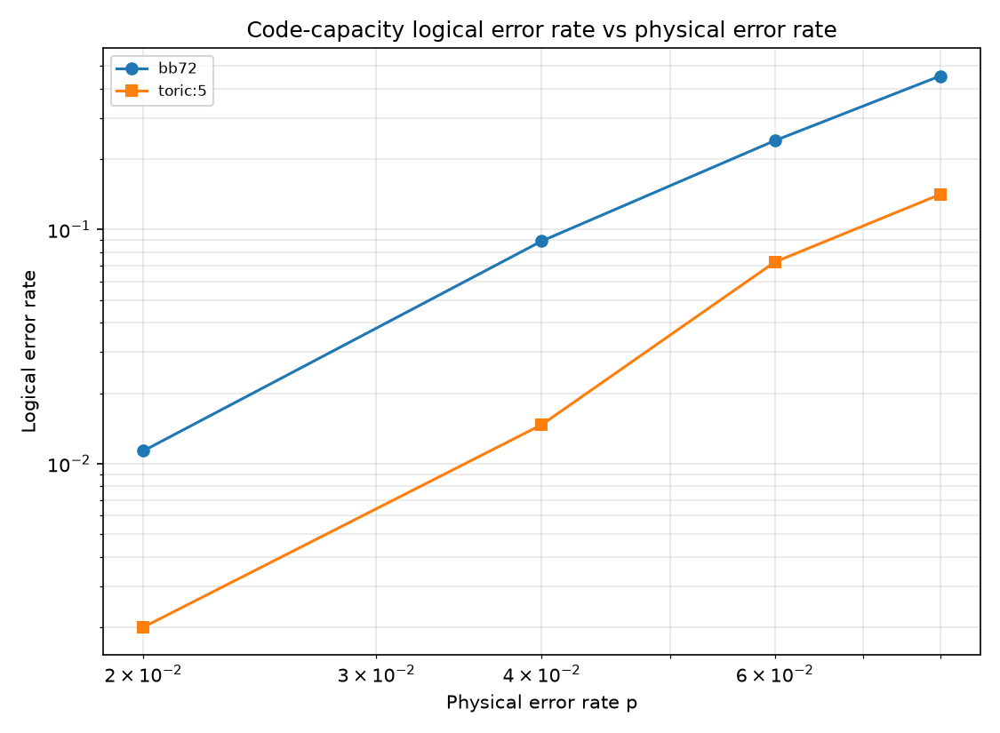

# Building Bivariate-Bicycle qLDPC Codes and Decoding Them with a From-Scratch BP+OSD

*Andrew Fogelis*

Repository: <https://github.com/afogelis/qldpc-builder>

## Abstract

Quantum low-density parity-check (qLDPC) codes promise far lower physical-qubit overhead than the surface code by encoding many logical qubits per block. The bivariate-bicycle and generalized-bicycle families were constructed from scratch over GF(2), together with a hypergraph-product toric code as a surface-family baseline, and their logical operators and encoding rates were computed exactly. A belief-propagation decoder with order-0 ordered-statistics post-processing (BP+OSD) was implemented directly, so that the study reproduces on any interpreter without a compiled dependency; the compiled ldpc package is supported as an optional faster backend. Under the code-capacity bit-flip model, a distance-comparable bivariate-bicycle code matched the toric baseline's logical error rate while encoding several times as many logical qubits per physical qubit, illustrating the qLDPC rate advantage. The block logical error rate of the highest-rate code was correspondingly larger because it aggregates over more logical qubits.

## Introduction

The surface code encodes a single logical qubit in a two-dimensional patch and pays a large physical-qubit overhead for it. Quantum LDPC codes break that geometric constraint: by allowing slightly longer-range checks they encode a constant fraction of logical qubits per physical qubit while keeping the checks sparse. The bivariate-bicycle codes of Bravyi and co-workers (2024) brought this family within reach of near-term hardware, achieving competitive thresholds at a fraction of the overhead.

This work was undertaken to build those codes from first principles and to decode them with the decoder they were designed for, belief propagation with ordered-statistics post-processing, in order to quantify the rate advantage of qLDPC codes over the surface code on a common, reproducible footing.

## Materials and Methods

Bivariate-bicycle codes were constructed on a two-dimensional torus from two matrices formed as sums of monomials in the commuting cyclic shifts of the two factors, giving CSS check matrices that commute by construction. Generalized- bicycle codes were built analogously from circulant polynomials over a single cyclic group, and a toric baseline was obtained as the hypergraph product of two cyclic repetition codes. The number of logical qubits and the logical operators were computed by GF(2) rank, null-space and quotient routines implemented for this purpose.

Decoding used a from-scratch BP+OSD: log-domain sum-product belief propagation produced a posterior error probability per qubit, and when belief propagation failed to explain the syndrome, order-0 ordered-statistics decoding ordered the qubits most-likely-error first, selected a full-rank information set by GF(2) elimination, and solved the syndrome exactly on it, guaranteeing a valid correction. Logical error rates were estimated under the code-capacity bit-flip model with Wilson confidence intervals; the compiled ldpc package was supported as an optional backend for cross-checking.

## Results

At a fixed physical error rate of four percent, the bivariate-bicycle codes occupied the high-encoding-rate region of the rate-versus-logical-error plane while the toric codes sat at vanishing rate. A bivariate-bicycle code on a nine-by-six torus, encoding eight logical qubits in one hundred and eight physical qubits, matched the toric baseline's logical error rate while encoding four times as many logical qubits per physical qubit.

The highest-rate code studied, which encodes twelve logical qubits in seventy-two physical qubits, showed a larger block logical error rate. This is expected and is reported plainly: the block error rate counts a failure if any of its twelve logical qubits is corrupted, so a higher-rate code with more logical qubits naturally fails more often per block even when its per-logical performance is comparable. The encoding-rate axis is the advantage being illustrated.

*Figure 1. Encoding rate versus code-capacity logical error rate at a physical error rate of four percent for bivariate-bicycle codes (circles) and toric baselines (squares). The qLDPC codes reach comparable logical error rates at several times the encoding rate.*

*Figure 2. Logical error rate versus physical error rate under the code-capacity bit-flip model for a bivariate-bicycle code and the distance-five toric code.*

## Discussion

Reproducing the qLDPC rate advantage from a hand-built code and a hand-built decoder clarifies why the advantage exists and what it costs: the codes pack many logical qubits into few physical qubits, and the price is a denser, more degenerate Tanner graph on which plain belief propagation does not converge, which is precisely why the ordered-statistics post-processing step is essential. That OSD always returns a syndrome-consistent correction is the property a stand-alone belief-propagation decoder lacks.

The study is deliberately limited to the code-capacity model and to small codes, so it illustrates the rate advantage qualitatively rather than quoting circuit-level thresholds or claiming any specific hardware-overhead figure. A circuit-level syndrome-extraction treatment with realistic noise, and a higher-order OSD via the compiled backend at larger block lengths, are the natural next steps.

## References

- Bravyi S, Cross AW, Gambetta JM, Maslov D, Rall P, Yoder TJ. High-threshold and low-overhead fault-tolerant quantum memory. Nature 2024; 627:778-782.
- Panteleev P, Kalachev G. Degenerate quantum LDPC codes with good finite length performance. Quantum 2021; 5:585.
- Roffe J, White DR, Burton S, Campbell E. Decoding across the quantum low-density parity-check code landscape. Physical Review Research 2020; 2:043423.
- Tillich JP, Zemor G. Quantum LDPC codes with positive rate and minimum distance proportional to the square root of the block length. IEEE Transactions on Information Theory 2014; 60:1193-1202.
- Dennis E, Kitaev A, Landahl A, Preskill J. Topological quantum memory. Journal of Mathematical Physics 2002; 43:4452-4505.
