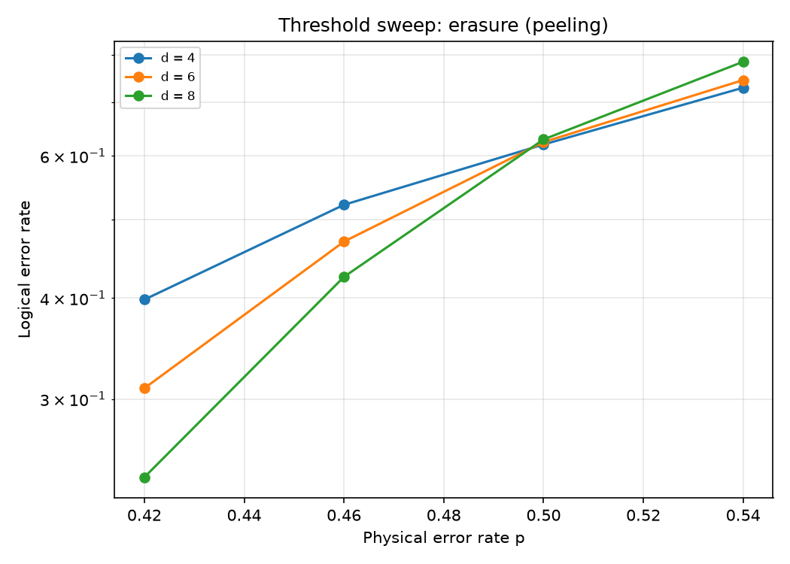

# Biased Noise and Heralded Erasure on the Toric Code: A Tale of Two Thresholds

*Andrew Fogelis*

Repository: <https://github.com/afogelis/qec-noise-profiles>

## Abstract

Real qubits do not fail with symmetric depolarising noise: they dephase far more than they bit-flip, and some platforms can detect when a qubit is lost. Both regimes were modeled on the toric code under the code-capacity model. Biased Pauli noise, parameterized by a Z-bias, was decoded with bias-aware weighted minimum-weight matching, and heralded erasure was decoded with a from-scratch peeling decoder. The peeling decoder reproduced the analytically known erasure threshold of one half - the bond-percolation threshold of the lattice - which validates the implementation, while depolarising noise crossed near sixteen percent. For the untailored toric code, concentrating noise on a single Pauli type did not raise the tolerable total error rate and was marginally worse than depolarising, because almost all the error then loads a single decoding graph. The threshold gain came from erasure conversion rather than bias alone.

## Introduction

The threshold of a quantum error-correcting code is quoted for a particular noise model, almost always symmetric depolarising noise, yet real devices are strongly biased toward dephasing and some can convert leakage or loss into heralded erasures whose location the decoder learns. How much the noise profile changes what a code can tolerate is therefore a practical question of first importance.

This work modeled biased Pauli noise and heralded erasure on the toric code and decoded each with the appropriate decoder, in order to compare the very different thresholds of the two regimes on a reproducible footing, and to test whether bias alone helps an untailored code.

## Materials and Methods

The distance-d toric code was constructed on a periodic square lattice with one qubit per edge, giving star and plaquette stabilisers whose parity-check matrices have column weight two and are therefore graph incidence matrices. Biased Pauli noise was parameterized by a total rate and a Z-bias, with a bias of one half recovering depolarising noise; each error type was decoded by minimum-weight matching whose edge weights were set from the per-qubit marginal flip probability, making the matching bias-aware. Heralded erasure replaced each erased qubit with a uniformly random Pauli while revealing the erased positions to the decoder.

Erasure was decoded with a from-scratch peeling decoder, which grows a spanning forest of the erased subgraph and peels pendant edges, assigning each the value that satisfies its leaf stabiliser; this reproduces the syndrome exactly and fails only when the erasure percolates a non-contractible loop. Thresholds were estimated from distance-by-physical-rate sweeps with Wilson confidence intervals. A Stim multi-Pauli-product front-end expresses the same code-capacity experiment natively and cross-checks the hand-written sampler.

## Results

The erasure threshold sweep produced a clean crossing of the distance-four, six and eight curves at a physical error rate of one half, the bond-percolation threshold of the lattice and the analytically known erasure threshold of the toric code. The depolarising sweep crossed near sixteen percent, consistent with the toric-code depolarising threshold under independent matching. Heralded erasure thus tolerated roughly three times the physical error rate of depolarising noise.

The comparison at fixed distance revealed a non-obvious result. Biased noise at a Z-bias of thirty was marginally worse than depolarising in terms of total physical error rate, not better. For the untailored toric code, concentrating the error on the Z type loads almost all of it onto a single decoding graph, whereas depolarising noise spreads it across both, so the tolerable total rate does not improve with bias.

*Figure 1. Code-capacity logical error rate versus physical error rate on a distance-eight toric code for heralded erasure, biased Pauli noise and depolarising noise. Erasure remains correctable up to a physical rate near one half; bias does not improve on depolarising.*

*Figure 2. Erasure threshold sweep. The distance-four, six and eight curves cross at a physical error rate near one half, the analytically known erasure threshold of the toric code.*

## Discussion

Reproducing the analytic one-half erasure threshold from a hand-built peeling decoder validates the implementation, and it illustrates the advantage of erasure conversion: the decoder uses the known location of each erased qubit rather than only its occurrence. The finding that bias alone does not help the untailored toric code indicates that the benefit of biased noise must be obtained with a code and decoder designed to exploit it, such as the XZZX surface code, rather than arising automatically.

The analysis is restricted to the code-capacity model and so does not quote circuit-level thresholds. Extending the biased-noise track to bias-tailored codes and the erasure track to a circuit-level syndrome-extraction schedule with measurement noise are the natural directions for future work.

## References

- Delfosse N, Zemor G. Linear-time maximum likelihood decoding of surface codes over the quantum erasure channel. Physical Review Research 2020; 2:033042.
- Stace TM, Barrett SD. Error correction and degeneracy in surface codes suffering loss. Physical Review A 2010; 81:022317.
- Tuckett DK, Bartlett SD, Flammia ST. Ultrahigh error threshold for surface codes with biased noise. Physical Review Letters 2018; 120:050505.
- Gidney C. Stim: a fast stabilizer circuit simulator. Quantum 2021; 5:497.
- Higgott O. PyMatching: A Python package for decoding quantum codes with minimum-weight perfect matching. ACM Transactions on Quantum Computing 2022; 3(3):16.
