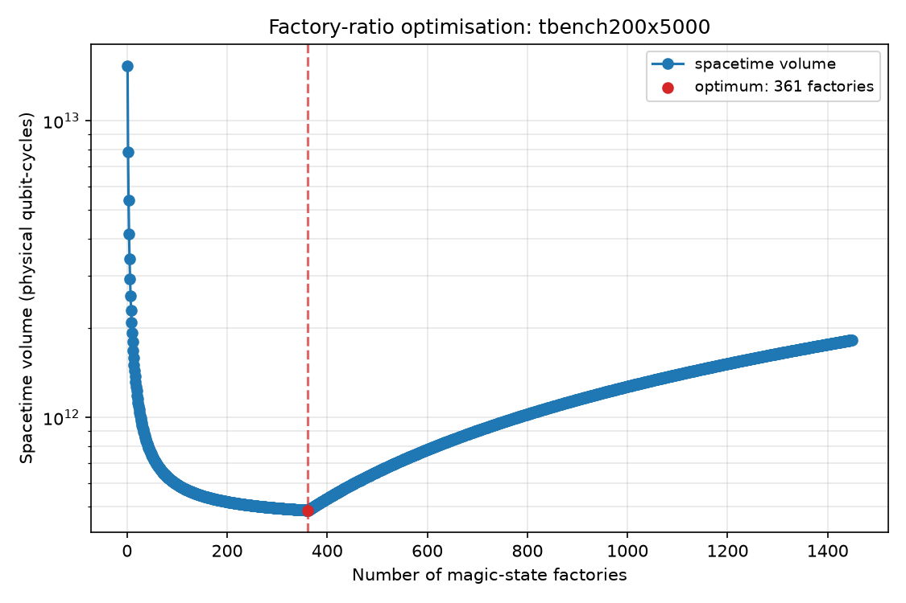
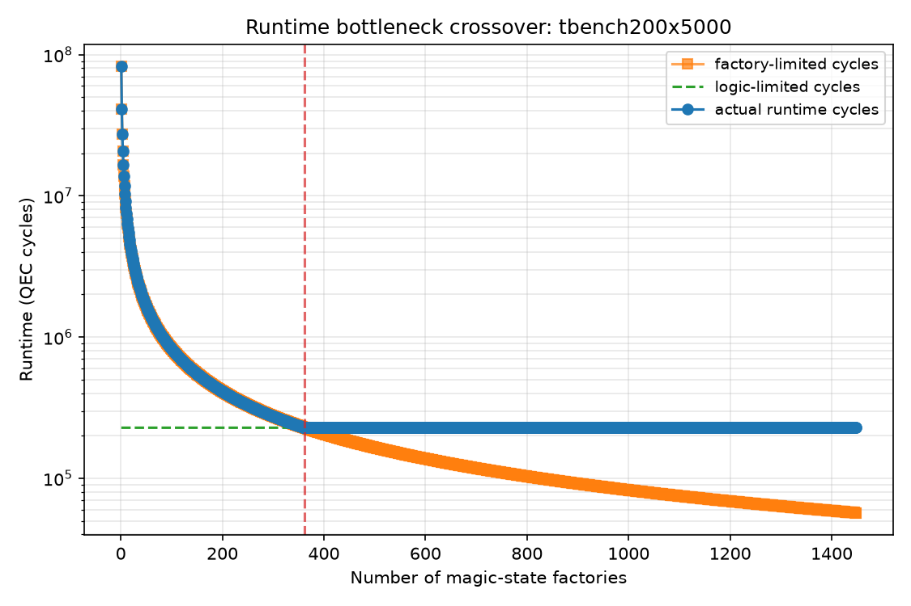

# Optimizing the Magic-State Factory Ratio to Minimize Spacetime Volume

*Andrew Fogelis*

Repository: <https://github.com/afogelis/active-volume-compiler>

## Abstract

A running fault-tolerant algorithm spends most of its physical qubits not on logical data but on the magic-state factories that supply its non-Clifford gates. A transparent resource compiler was built to map a Clifford+T circuit onto a surface-code lattice-surgery layout and to optimize the number of factories. The circuit is reduced to its fault-tolerance-relevant summary - logical qubit count, T-count, T-depth and peak parallel T-demand - by an as-soon-as-possible scheduler, and the layout is costed in surface-code tiles. The runtime is the larger of the time to execute the logical layers and the time to produce every magic state, so the architecture is either data-limited or factory-limited. Scanning the factory count revealed a clear interior minimum of the spacetime volume, located exactly at the crossover between the two regimes, demonstrating a quantitative answer to how many factories a computation should provision.

## Introduction

Surface-code computation proceeds by lattice surgery on logical patches, consuming distilled magic states to implement the non-Clifford gates that give quantum computation its power. Magic-state distillation is expensive, and the factories that perform it occupy a large fraction of the device; provisioning them is therefore a central architectural decision. Too few factories and the computation stalls waiting for magic states; too many and idle factory tiles inflate the footprint.

This work built a compiler pass that turns a logical circuit into a physical-qubit and runtime budget and then optimizes the factory ratio, in order to demonstrate, with a transparent cost model, that a volume-optimal number of factories exists and where it lies.

## Materials and Methods

A Clifford+T circuit was represented as a flat gate list and reduced to a cost summary by an as-soon-as-possible scheduler that places each gate in the first layer after the latest layer touching any of its qubits; non-Clifford gates were charged their standard T-count, one for a T gate and seven for a Toffoli. The scheduler yields the T-count, the T-depth, the peak per-layer T-demand and the total logical depth.

The layout was costed in surface-code tiles of two times the distance squared physical qubits each: logical data and routing occupy a fixed number of tiles per logical qubit, and each magic-state factory occupies a fixed number of tiles and emits one T-state every few code cycles. The runtime in cycles was taken as the maximum of the logic-limited time, the logical depth times the distance, and the factory-limited time, the T-count times the factory period divided by the number of factories. Spacetime volume was the physical-qubit footprint times the runtime in cycles, and the factory count minimizing it was found by scanning. All parameters are overridable and set to order-of-magnitude literature values.

## Results

For a T-heavy benchmark consuming one million magic states, the spacetime volume fell steeply as factories were added while the computation was factory-limited, reached a minimum, and then rose linearly as further idle factories only added area. The optimum for this benchmark fell at a few hundred factories, at a footprint of roughly two million physical qubits.

Decomposing the runtime made the mechanism explicit. The factory-limited time falls inversely with the number of factories while the logic-limited time is a constant floor; the actual runtime is their maximum, and the volume-optimal factory count sits exactly at their crossover, where buying more factories stops shortening the computation and only enlarges it.

*Figure 1. Spacetime volume versus number of magic-state factories for a T-heavy benchmark. The volume is minimized at an interior optimum (marked), between the factory-limited and data-limited regimes.*

*Figure 2. Runtime decomposed into the factory-limited time, which falls inversely with factory count, and the logic-limited floor. The actual runtime is their maximum, and the volume optimum lies at their crossover.*

## Discussion

The existence of an interior volume optimum, and its location at the factory/logic crossover, is the quantitative lesson: a fault-tolerant architecture should provision just enough factories to make magic-state production keep pace with the logical circuit, and no more. Expressing the trade-off through a transparent tile-based model makes the answer inspectable and easy to re-run under different hardware assumptions.

The model is an architecture-level estimator, not a placement-and-routing compiler: it does not lay out individual patches, schedule lattice-surgery operations cycle by cycle, or implement the full active-volume accounting of Litinski and Nickerson. It is intended to capture the shape of the trade-off rather than to certify a specific device's qubit count. A cycle-accurate scheduler and an explicit distillation-factory model are the natural next steps.

## References

- Litinski D. A game of surface codes: large-scale quantum computation with lattice surgery. Quantum 2019; 3:128.
- Litinski D. Magic state distillation: not as costly as you think. Quantum 2019; 3:205.
- Litinski D, Nickerson N. Active volume: an architecture for efficient fault-tolerant quantum computers. arXiv:2211.15465, 2022.
- Fowler AG, Mariantoni M, Martinis JM, Cleland AN. Surface codes: Towards practical large-scale quantum computation. Physical Review A 2012; 86:032324.
